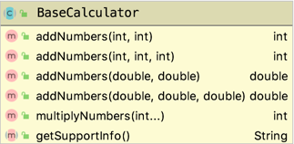

# Module 2 Lab 1 -- Classes and Interfaces

## Getting Started:

1. Clone or download a ZIP of this repository
1. If you downloaded a zip, extract the files to a working directory
1. Start IntelliJ and close any projects that reappear after opening
1. From the Welcome screen, choose "Open" navigating to the directory that contains the contents of this repository
1. When the message, "Maven projects need to be imported" appears in the bottom, right portion of the IntelliJ workspace, choose "Enable Auto-Import"
1. If necessary, open the "Project" pane so you can see the files under your new project

## Interfaces

### Defining Default methods

**Steps:**
1. _____ Under src > main > java > edu.cscc.jccr.module2, create an **interface** called ``BasicCalculator``
1. _____ Under src > main > java > edu.cscc.jccr.module2, create a **class** called ``TiCalculator`` that implements ``BasicCalculator``
1. _____ Under src > main > java > edu.cscc.jccr.module2, create a **class** called ``HpCalculator`` that implements ``BasicCalculator``
1. _____ In ``BasicCalculator``, create a *default* method ``String getModel ()`` that returns the String "Basic Calculator"
1. _____ Open ``HpCalculatorTests`` under src > **test** > java > edu.cscc.jccr.module2 and add the following code:
    ```java
      private final HpCalculator hpCalculator = new HpCalculator();
    
      @Test
      @DisplayName("T01: getModel() correctly")
      void getModelWorksCorrectlyTest() {
        assertEquals("Basic Calculator", hpCalculator.getModel(), "hpCalculator.getModel() should return \"Basic Calculator\"");
      }
    ```
1. _____ Right click on HpCalculatorTests and choose Run 'HpCalculatorTests' verifying your first test passes 

**Questions:**
* As of now, would ``TiCalculator`` also return "Basic Calculator" ? _____________
* Why or why not?


### Implementing Default Methods

**Steps:**
1. _____ Open ``TiCalculatorTests`` under src > **test** > java > edu.cscc.jccr.module2 and add the following code:
    ```java
      private final TiCalculator tiCalculator = new TiCalculator();
    
      @Test
      @DisplayName("T01: getModel() correctly")
      void getModelWorksCorrectlyTest() {
        assertEquals("Texas Instruments Calculator", tiCalculator.getModel(), "tiCalculator.getModel() should return \"Texas Instruments Calculator\"");
      }
    ```
1. _____ Right click on TiCalculatorTests and choose Run 'TiCalculatorTests' verifying this test **fails** 
1. _____ Implement the ``void printModel ()`` method in ``TiCalculator`` having it return "Texas Instruments Calculator"
1. _____ Rerun the test from step 2, making sure it succeeds this time

**Questions:**
* As of now, what string will ``HpCalculator.getModel()`` return? _____________
* How can you change that? _____________
* What is the benefits of a default method? _____________
* How else could this functionality be implemented? _____________


### Implementing Interface Methods

**Steps:**
1. _____ Under src > main > java > edu.cscc.jccr.module2, create an **interface** called ``ScientificCalculator``
1. _____ Add the following method: ``public int square (int number)`` to ``ScientificCalculator`` 
1. _____ Have ``TiCalculator`` implement both ``BasicCalculator`` and ``ScientificCalculator``
1. _____ Implement the ``square`` method in TiCalculator having it ``return number * number``
1. _____ In ``TiCalculatorTests``, and add the following code:
    ```java
      @Test
      @DisplayName("T02: square() works correctly")
      void squareWorksCorrectlyTest() {
        assertEquals(25, tiCalculator.square(5), "5 squared should be 25");
        assertEquals(16, tiCalculator.square(4), "4 squared should be 16");
      }
    ```

**Questions:**
* Could you add this same test to ``HpCalculatorTests``? _____________
* Why or why not? _____________

## Inheritance

### Creating and Using a Superclass

**Steps:**
1. _____ Under src > main > java > edu.cscc.jccr.module2, create a **class** called ``BaseCalculator``
1. _____ Add the following method: ``public int addNumbers (int n1, int n2)`` having it  ``return n1 + n2`` 
1. _____ Have ``HpCalculator`` extend ``BaseCalculator``
1. _____ Have ``TiCalculator`` extend ``BaseCalculator``
1. _____ Open ``BaseCalculatorTests`` under src > **test** > java > edu.cscc.jccr.module2 and add the following code:
    ```java
      private final BaseCalculator baseCalculator = new TiCalculator();
    
      @Test
      @DisplayName("T01: add (int, int) works correctly")
      void addTwoIntsWorksCorrectlyTest() {
        assertEquals(2, baseCalculator.addNumbers(1, 1), "1 + 1 should equal 2");
        assertEquals(5, baseCalculator.addNumbers(3, 2), "3 + 2 should equal 5");
      }
    ```
1. _____ Run ``BaseCalculatorTests`` making sure your first test passes

**Questions:**
* Why does ``BaseCalculatorTests`` do a new() on ``TiCalculator`` rather than ``BaseCalculator``? _____________
* If you change the test to use ``HpCalculator``, would it still work? _____________
* Why or why not? _____________

### Abstract Classes

**Steps:**
1. _____ Create an ``abstract`` method in ``BaseCalculator`` called ``getSupportInfo`` that takes no parameters and returns ``String``
1. _____ Change ``BaseCalculator`` to be ``abstract`` 
1. _____ Add the new method to ``HpCalculator`` and ``TiCalculator`` having them return "hp.com" and "ti.com" respectively
1. _____ Below the last test in ``HpCalculatorTests``, add the following:
    ```java
      @Test
      @DisplayName("T02: getSupportInfo() works correctly")
      void getSupportInfoWorksCorrectlyTest() {
        assertEquals("hp.com", hpCalculator.getSupportInfo(), "hpCalculator.getSupportInfo() should return \"hp.com\"");
      }
    ```
1. _____ Rerun ``HpCalculatorTests`` making sure all tests pass
1. _____ Below the last test in ``TiCalculatorTests``, add the following:
    ```java
      @Test
      @DisplayName("T03: getSupportInfo() works correctly")
      void getSupportInfoWorksCorrectlyTest() {
        assertEquals("ti.com", tiCalculator.getSupportInfo(), "tiCalculator.getSupportInfo() should return \"ti.com\"");
      }
    ``` 
1._____ Rerun ``TiCalculatorTests`` making sure all tests pass
    
**Questions:**
* What are abstract methods reminiscent of? _____________
* How could abstract classes be useful?  _____________

## Overloading Methods



**Steps:**
1. _____ Below the last test in ``BaseCalculatorTests``, add the following:
    ```java
      @Test
      @DisplayName("T02: add (int, int, int) works correctly")
      void addThreeIntsWorksCorrectlyTest() {
        assertEquals(3, baseCalculator.addNumbers(1, 1, 1), "1 + 1 + 1 should equal 3");
        assertEquals(10, baseCalculator.addNumbers(3, 2, 5), "3 + 2 + 5 should equal 10");
      }
    
      @Test
      @DisplayName("T03: add (double, double) works correctly")
      void addTwoDoublesWorksCorrectlyTest() {
        assertEquals(2.0, baseCalculator.addNumbers(1.0, 1.0), "1.0 + 1.0 should equal 2.0");
        assertEquals(5.5, baseCalculator.addNumbers(3.25, 2.25), "3.25 + 2.25 should equal 5.5");
      }
    
      @Test
      @DisplayName("T04: add (double, double, double) works correctly")
      void addThreeDoublesWorksCorrectlyTest() {
        assertEquals(4.5, baseCalculator.addNumbers(1.5, 1.5, 1.5), "1.5 + 1.5 + 1.5 should equal 4.5");
      }
    ```
1. _____ in ``BaseCalculator``, add and implement the additional ``addNumbers`` methods shown in the class diagram above so your new tests will pass
1. _____ Rerun ``BaseCalculatorTests`` making sure all tests pass

**Questions:**
* With four ``addNumbers`` methods, How does Java know which one to invoke? _____________

## Variable Arguments


**Steps:**
1. _____ Below the last test in ``BaseCalculatorTests``, add the following:
    ```java
      @Test
      @DisplayName("T05: multiplyNumbers(int...) works correctly")
      void multiplyNumbersWorksCorrectlyTest() {
        assertEquals(0, baseCalculator.multiplyNumbers(), "nothing to multiply should equal 0");
        assertEquals(5, baseCalculator.multiplyNumbers(5), "5 * nothing should equal 5");
        assertEquals(10, baseCalculator.multiplyNumbers(10), "10 * nothing should equal 10");
        assertEquals(2, baseCalculator.multiplyNumbers(1, 2), "1 * 2 should equal 2");
        assertEquals(6, baseCalculator.multiplyNumbers(1, 2, 3), "1 * 2 * 3 should equal 6");
      }
    ```
1. _____ in ``BaseCalculator``, add and implement the ``multiplyNumbers`` method shown in the class diagram above
1. _____ Rerun ``BaseCalculatorTests`` making sure all tests pass

**Questions:**

* How can you use this technique to simplify ``BaseCalculator``? _____________

**Bonus Assignment:** use this technique to simplify ``BaseCalculator`` making sure the tests still pass. 